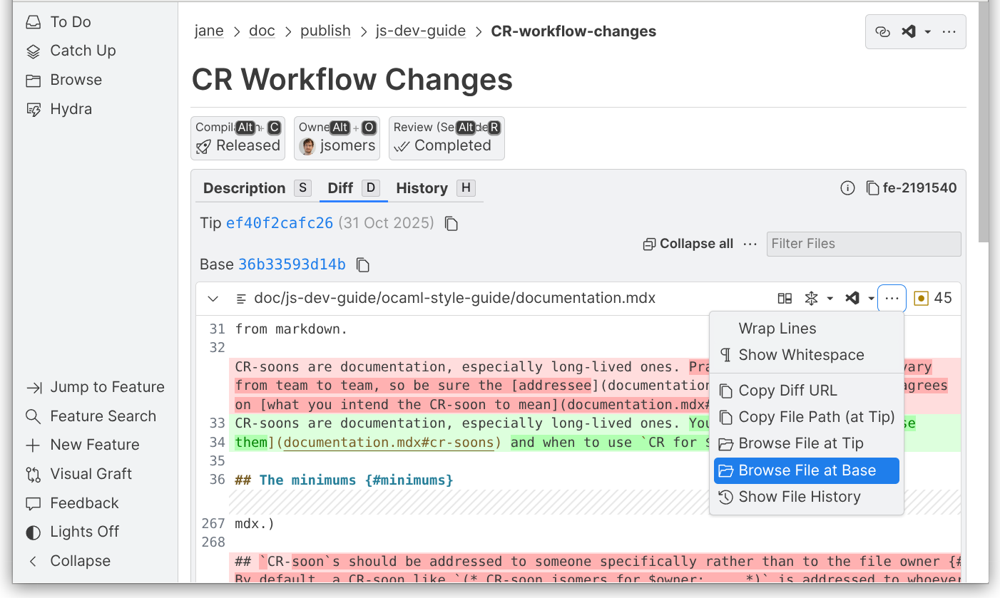
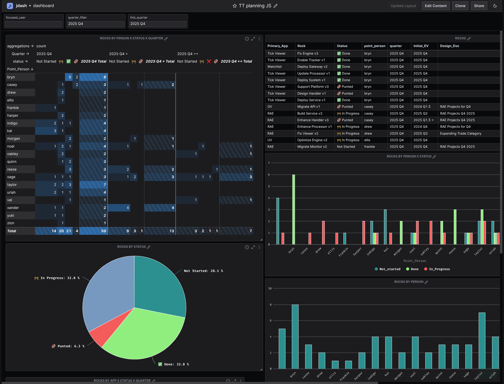

# Bonsai

<h1 align="center">
  <picture>
    
  </picture>
  <br>
  Bonsai
</h1>

Bonsai is a UI library for building performant, reactive web applications in OCaml, partly
inspired by [Elm](https://elm-lang.org/). It is used to build almost all web applications
inside Jane Street, everything from the corporate directory to tools that monitor and
interact with our trading systems. A simple Bonsai component with a little interactivity
looks like this:

```ocaml
module Dice = struct
  let faces =
    [ "⚀"; "⚁"; "⚂"; "⚃"; "⚄"; "⚅" ]
  ;;

  let component (graph @ local) =
    (* Components are implemented as purely functional state machines. *)
    let face, set_face = Bonsai.state (List.hd_exn faces) graph in
    (* Components are incrementally rendered, only when the relevant parts of the state change. *)
    let%arr face and set_face in
    {%html|
      <div>
        You rolled a #{face}
        <button
          style="" on_click=%{fun _ ->
            let index = Random.int (List.length faces) in
            set_face (List.nth_exn faces index)}
        >
          Roll the dice
        </button>
      </div>
    |}
  ;;
end
```

<div style="display: flex; flex-direction: column; align-items: center; gap: 20px;">
  <div style="display: flex; gap: 20px; align-items: flex-start;">
    
    
  </div>
  <div style="font-style: italic;">Most internal Jane Street web applications are built with Bonsai</div>
</div>

Components are implemented as purely functional state machines, and are easily
composable. Incrementalization inside the framework means that values don’t get recomputed
until necessary. This applies to every value, not just the view.

## Why Bonsai?

Other web frameworks tend to lump together state, incrementality, and rendering into a
single abstraction, the UI component. By contrast, Bonsai allows you to compose state and
incrementality primitives a la carte. The same primitives that prevent re-rendering the
entire page during user interaction can also be used to incrementalize an expensive
business logic computation on a live-updating dataset. (If you're used to React, imagine
if everything used something very similar to hooks, and state was managed outside of the
component hierarchy.)

Since state is not associated with explicit components, there is an extensive API for
managing the lifecycle and scoping of state as users interact with the page. For instance,
if you wanted to embed a collection of stateful UI components inside another UI component
(in a tabbed interface, say), Bonsai will handle the state management for you instead of
requiring that you manually hoist every internal component's state to the app's top-level
model. For more examples of how state is composed, see this [composition comparison](https://tyoverby.com/composition-comparison/)
written by the creator of Bonsai.

And because Bonsai is written in OCaml, it becomes possible to use the same language and
types on both the backend and frontend. It's hard to overstate the impact this has on
legibility and keeping a large web app's codebase manageable, especially when you make
pervasive use of OCaml's type system to reduce errors. At Jane Street, many internal
systems previously only had terminal UIs, and the framework has made it easy to port the
existing types and business logic to the web.

Bonsai also comes with a powerful templating language, support for component-specific
stylesheets, and a system for whole-app automated tests.

## Expressive tests that save you from manually clicking through your app

One of Bonsai’s most powerful features is its ability to let you easily write realistic
tests, in which you programatically manipulate UI elements and watch your DOM evolve.

In the following example, we’re testing the behavior of a user-selector. Whatever you type
in the text box gets appended to a little “hello” message:

```ocaml
let%expect_test "shows hello to a specified user" =
  let handle = Handle.create (Result_spec.vdom Fn.id) hello_textbox in
  Handle.show handle;
  [%expect
    {|
    <div>
      <input oninput> </input>
      <span> hello  </span>
    </div> |}];
  Handle.input_text handle ~get_vdom:Fn.id ~selector:"input" ~text:"Bob";
  Handle.show_diff handle;
  [%expect
    {|
      <div>
        <input oninput> </input>
-      <span> hello  </span>
+      <span> hello Bob </span>
      </div> |}];
```

Notice that there are two [expect
blocks](https://blog.janestreet.com/the-joy-of-expect-tests/). (This allows you to make
multiple assertions within a given scenario and to scope setup/helper code to just that
scenario.)

The first makes our UI visible, and the second---which contains a diff---shows some
behavior after you programatically input some text. Bonsai will even show you how html
attributes or class names change in response to user input. Tests can include mock server
calls, and can involve changes not just to the UI but to the state that drives it. With
tests like these you can write an entire component without opening your browser.

## Documentation

The [Bonsai
Quick Start](https://github.com/janestreet/bonsai_web/blob/master/docs/quick-start.md) and [Thinking in Bonsai](https://github.com/janestreet/bonsai_web/blob/master/docs/thinking-in-bonsai.md)
provide a hands on introduction to Bonsai and are the best places to start learning
about it. There's also:

* A series of [how-to
  articles](https://github.com/janestreet/bonsai_web/tree/master/docs/how_to).
* A short series of posts about Bonsai's
  [history](https://github.com/janestreet/bonsai_web/blob/master/docs/blog/history.md).
* An [episode](https://signalsandthreads.com/building-a-ui-framework/) of our Signals &
  Threads podcast about "Building a UI Framework." Another
  [episode](https://signalsandthreads.com/building-tools-for-traders/) on "Building Tools
  for Traders" discussed some of the benefits of using Bonsai.
* A [library](https://github.com/janestreet/bonsai_examples) filled with example websites
  built with Bonsai.
* API documentation can be found in the
  [cont.mli](https://github.com/janestreet/bonsai/blob/master/src/cont.mli)
  file.

## Bonsai is really a collection of libraries

Er, one wrinkle: Bonsai itself -- this library -- is actually more generic than the above
makes it sound. It allows you to build general-purpose incremental, composable state
machines. [Bonsai_web](https://github.com/janestreet/bonsai_web) builds on top of that
core library, specializing it for interactive browser-based UIs, but we also have
[Bonsai_term](https://github.com/janestreet/bonsai_term) for building interactive
*terminal*-based UIs. There was even a prototype for April Fools' Day of Bonsai\_vr for
reactive virtual-reality UIs.

The full suite of Bonsai libraries:

### General-purpose libraries

[Bonsai](https://github.com/janestreet/bonsai) is a library for building incremental,
composable state machines.

* [Testing](https://github.com/janestreet/bonsai_test)

### Browser-based UI Libraries

[Bonsai_web](https://github.com/janestreet/bonsai_web) is a library for building
interactive browser-based UI using `bonsai`.

* [Examples](https://github.com/janestreet/bonsai_examples)
* [Components](https://github.com/janestreet/bonsai_web_components)
* [Testing](https://github.com/janestreet/bonsai_web_test)
* [Benchmarking](https://github.com/janestreet/bonsai_bench)
  
### Terminal-based UI Libraries

[Bonsai_term](https://github.com/janestreet/bonsai_term) is a library for building
interactive terminal-based UIs using `bonsai`.

* [Examples](https://github.com/janestreet/bonsai_term_examples)
* [Components](https://github.com/janestreet/bonsai_term_components)
* [Testing](https://github.com/janestreet/bonsai_term_test)

### Pre-processors

Bonsai web applications often use the following preprocessors:

- [ppx_html](https://github.com/janestreet/ppx_html) is a preprocessor for writing HTML
  that is similar to [JSX](https://en.wikipedia.org/wiki/JavaScript_XML).
- [ppx_css](https://github.com/janestreet/ppx_css) is a preprocessor for writing CSS.


