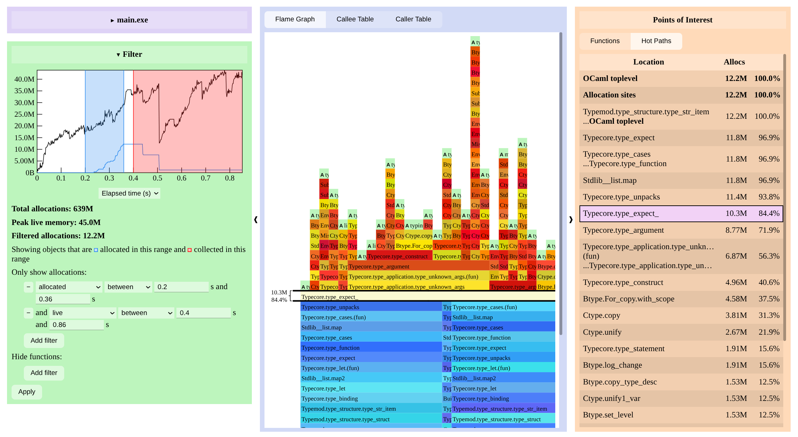

<h1 align="center">
  <picture>
    
  </picture>
  <br>
  Memtrace
</h1>

Memtrace is a streaming client for OCaml's Memprof, which generates 
compact traces of a program's memory use. At Jane Street it has been 
used to find memory leaks in real systems, and it's one of the core
tools we teach in our Performance analysis [teach-in][teach-in].

The Memtrace viewer analyzes the events produced by Memtrace and presents 
graphical views. Filters allow you to interactively narrow the view 
until the source of the memory problem becomes clear.



Our ["Finding memory leaks with Memtrace"][blog-post] blog post walks 
through an example session.

Memtrace knows more about allocations than their creation: it can tell you, for a
particular sample, when---if ever---it is collected, and filter on combinations of these
data. This can be very helpful for finding leaks. 

[teach-in]: https://blog.janestreet.com/developer-education-at-jane-street-index/
[blog-post]: https://blog.janestreet.com/finding-memory-leaks-with-memtrace/

## Usage

There is no special compiler or runtime configuration needed to collect a 
trace of your program. You need only link in the `memtrace` library and add 
a line or two of code. The library is available in OPAM, so you can install 
it by running

```
$ opam install memtrace
```

and link it into your application by adding it to your dune file:

```
(executable
 (name my_program)
 (libraries base foo bar memtrace))
```

For most applications, it will suffice to add a call to `Memtrace.trace_if_requested`
wherever you want to start tracing. Typically this will be right at the beginning of your
startup code:

```ocaml
let _ =
  Memtrace.trace_if_requested ~context:Version_util.version ();
  ...
```

If the `MEMTRACE` environment variable is present, tracing begins to
the filename it specifies. (If it's absent, nothing happens.)

The `~context` parameter is optional, and can be set to any string that
helps to identify the trace file.

If the program daemonises, the call to `trace_if_requested` should
occur *after* the program forks, to ensure the right process is
traced.
